# $${\color{gold}Harry \space Potter \space Game}$$

## **This is second project for Code Institute Software Development Course - Flip card memory game with Harry Potter theme.**

---

### _Game offers great challenge for all Harry Potter fans. Reveal cards with Harry Potter universe characters within time limit._

---

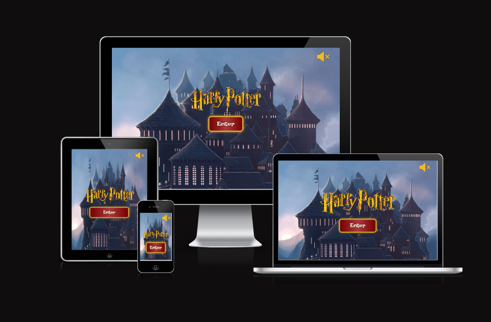

### [Live Site](https://jarekb-dev.github.io/Harry-Potter/)

---

### [Project Repository](https://github.com/JarekB-dev/Harry-Potter)

---

## Table of Contents

1. [UX](#ux)
2. [Features](#features)
3. [Technologies Used](#technologies)
4. [Testing](#testing)
5. [Deployment](#deployment)
6. [Resources](#resources)
7. [Credits](#credits)
8. [Acknowledgments](#acknowledgments)

---

# $${\color{orange}UX}$$

- User should be able to navigate in the game with no issues.
- User should see full game area with cards in the middle of the screen.
- User should be able to start the game with timer set to 60 seconds to finish the game.
- User should to flip cards to see their corresponding images.
- User should be able to see game result after fining all matching cards or when timer ends.
- User should be able to restart the game and reset the timer.
- User should be able to turn on and off the sounds in the game.

## Theme

My decision was that the most appropriate approach would be to use colors from Hogwarts House of Main protagonist - Gryffindor, therefore I have used below colors:

    - #740001 - Dark Red
    - #D3A625 - Gold
    - #EEBA30 - Yellow

I wanted to make sure that colors have proper contrast and are easily read by visual impaired users, but also to be similar to the one used in Harry Potter logo. Also, font have been chosen with same in mind to make sure that all information is clear and easy to read. Therefore, game contain below font:

    - Lakki Reddy

## Wireframes

### Main Screen - Desktop View

---

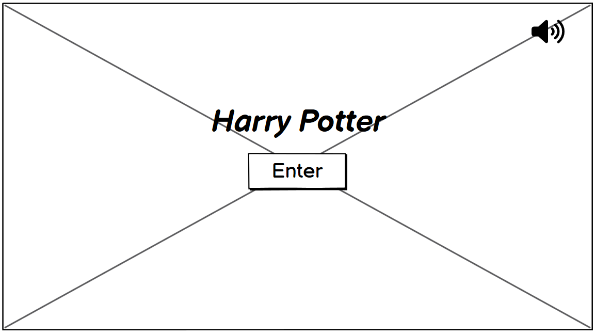

---

### Name Screen - Desktop View

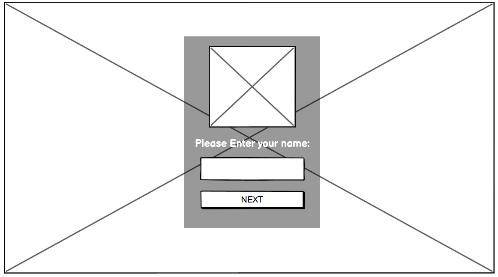

---

### Game Explanation Screen - Desktop View

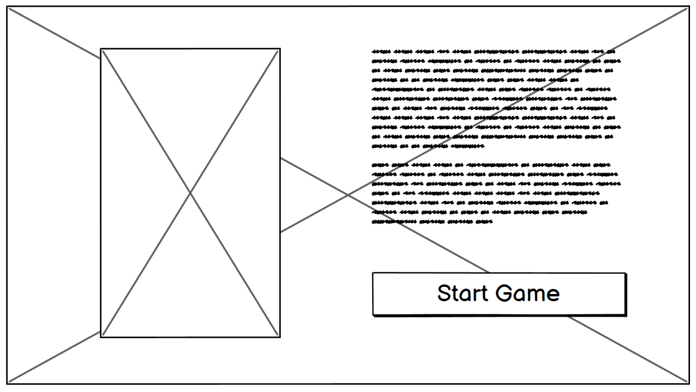

---

### Game Area - Desktop View

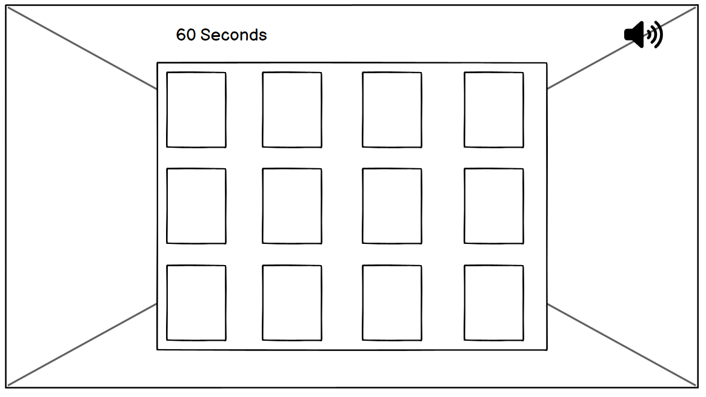

---

### Game result - Desktop View

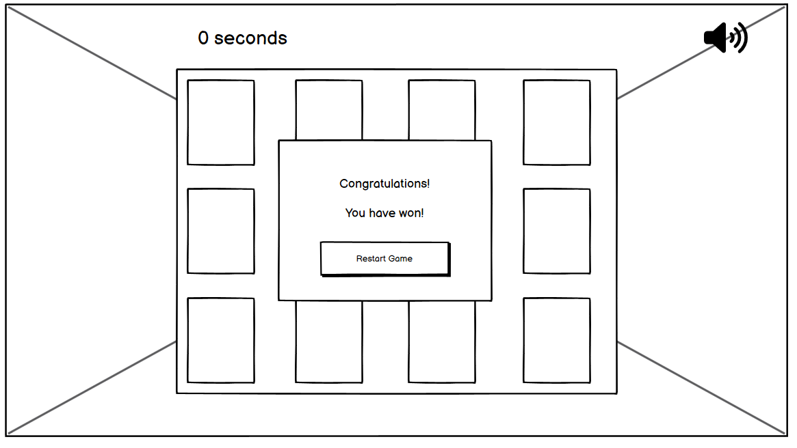

---

### Main Screen - Mobile View

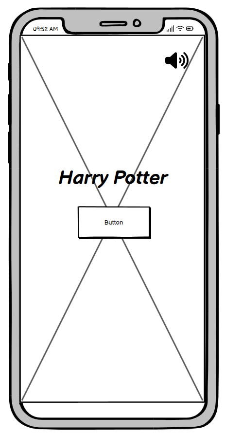

---

### Name Screen - Mobile View

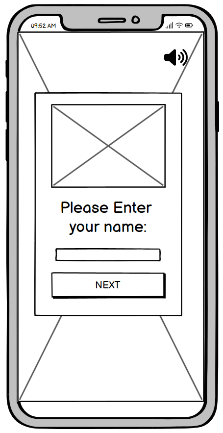

---

### Game Explanation Screen - Mobile View

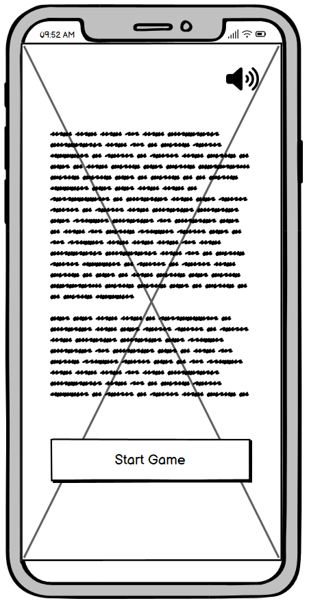

---

### Game Area - Mobile View

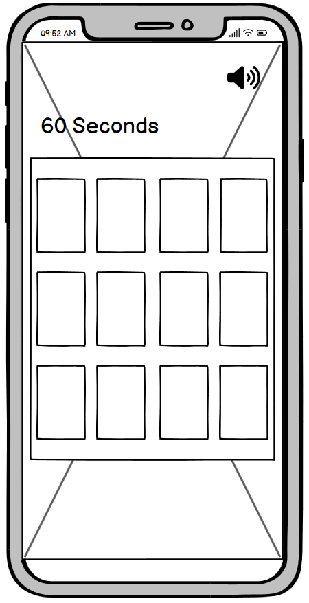

---

### Game Result - Mobile View

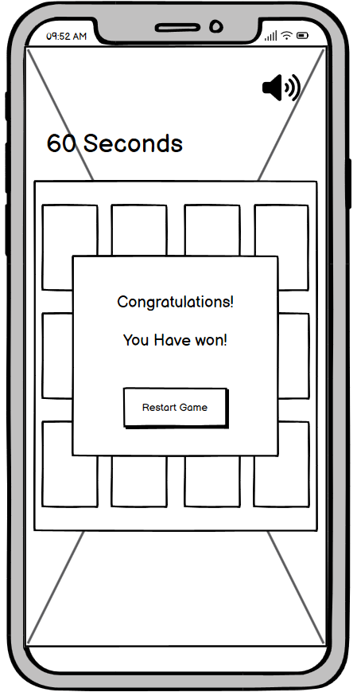

---

# $${\color{orange}Features}$$

**Main Screen**

- Floating center logo with button to progress into Game Area.

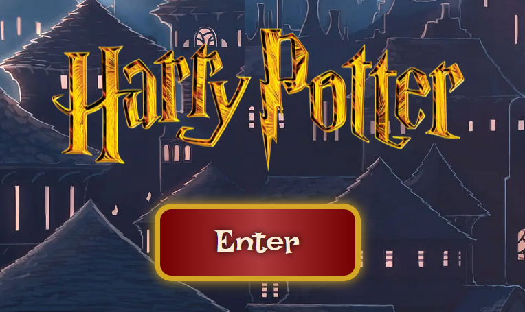

- Toggle sound icon in the top right corner of the screen.

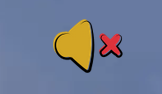

- Name screen with Hogwarts houses logo, Player name text field and button to progress into Game Explanation Screen. Player is able to enter their name or leave it blank and progress further with button click or Enter key.

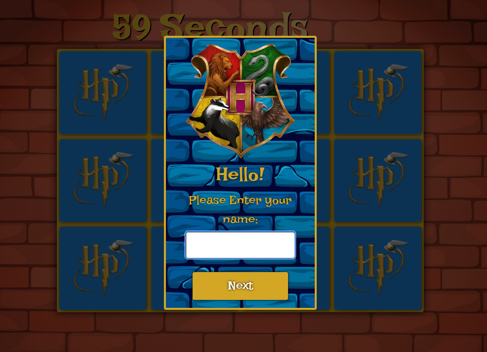

- Game Explanation screen with Harry Potter image, game rules and button to Start the Game.

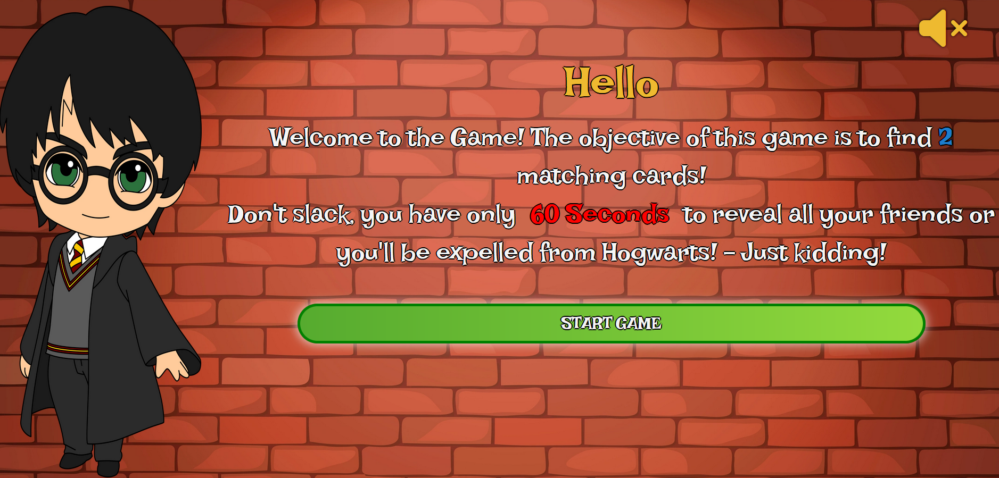

- Game Area with 12 flip cards and 60 seconds timer.

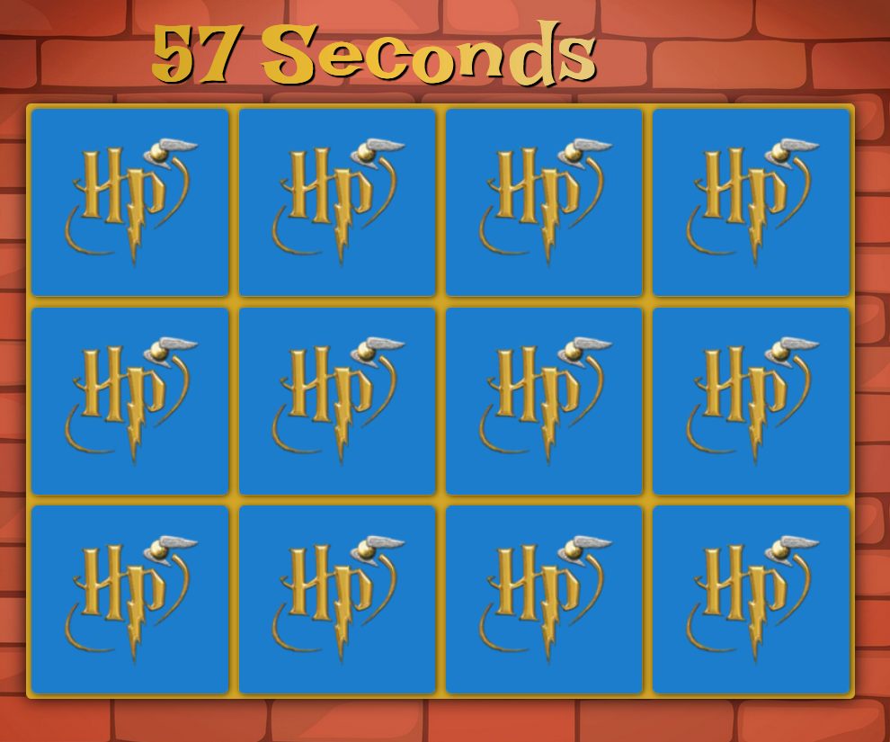

- Game result message depending if Player has won or lost the game.

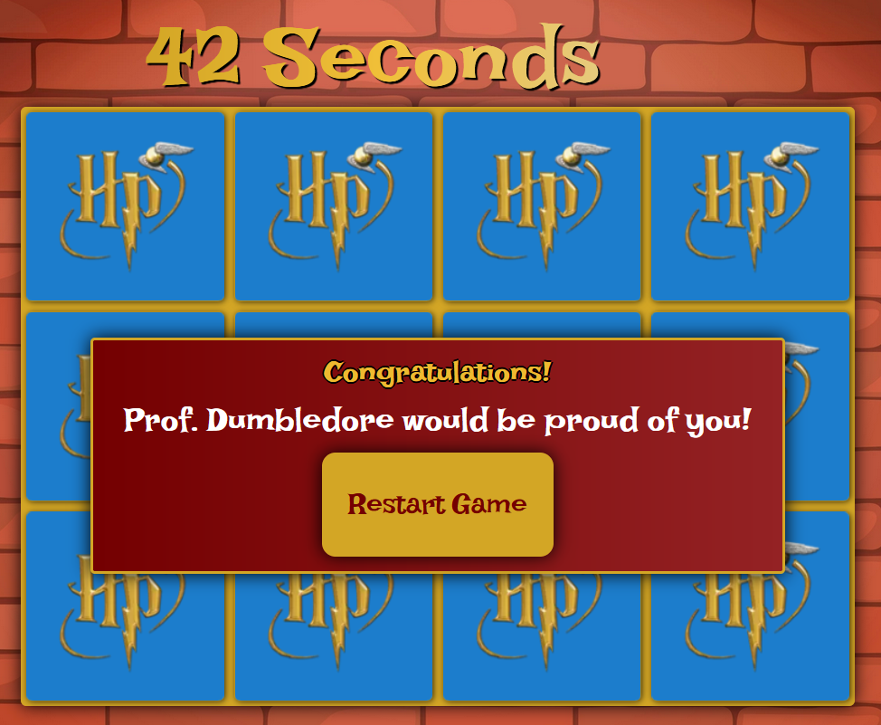
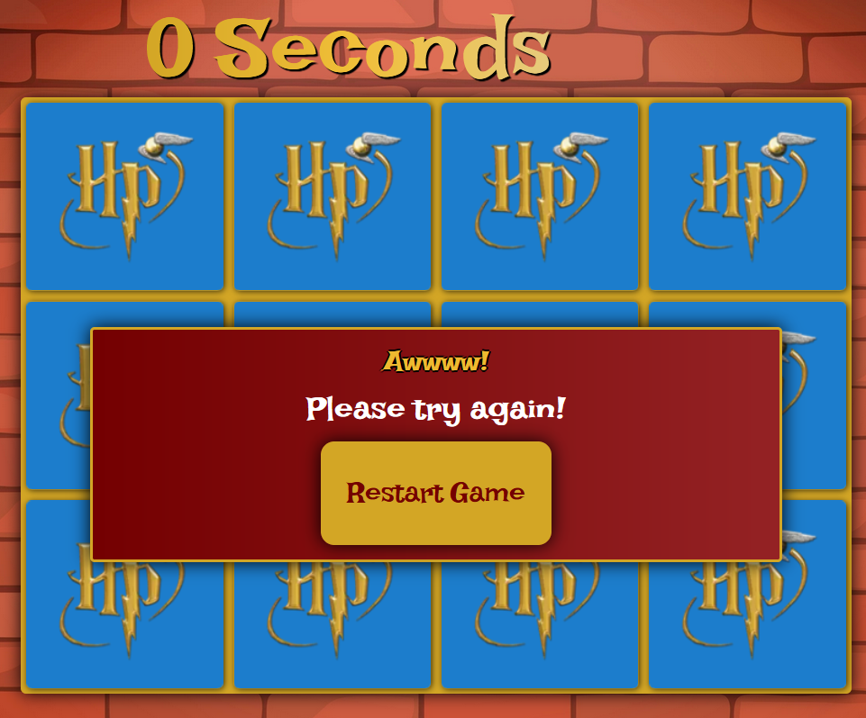

---

# $${\color{orange}Technologies \space Used}$$

## HTML

> Used to properly structure my project.

## CSS

> Used to style my project and change layout of elements.

## JavaScript

> Used for flip card game logic.

## Google Fonts

> Used for all fonts in my project.

## Favicon.cc

> Used to create Favicon Logo.

## Freeconvert.com

> Used to convert my images to Webp format for smaller sizes and improving loading times.

---

# $${\color{orange}Testing}$$

## Devices

#### In order to check responsiveness on different devices and to ensure that the Game is easy to use, I tested the project myself with the help of my colleagues. The following devices were used for testing:

> Desktop with viewport 2560x1440

> Macbook Air with viewport 1440x900

> iPad with viewport of 768x1024

> iPhone 12 Pro with viewport of 390x844

- Game was fully responsive with expected layout. All buttons work correctly.

- Game logic is working correctly.

- Sound toggle buttons turn sound on and off as expected.

- Game result message working correctly depending on Players actions.

---

## Google Chrome Lighthouse - Desktop

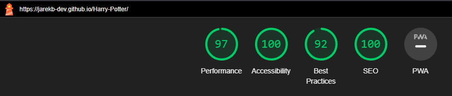

---

## Google Chrome Lighthouse - Mobile

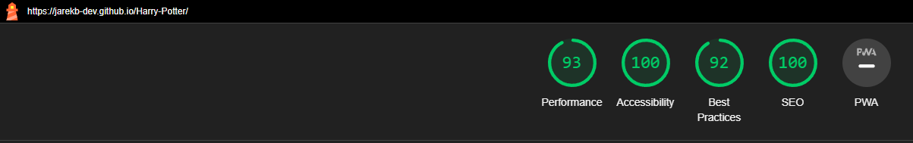

---

## HTML Validator

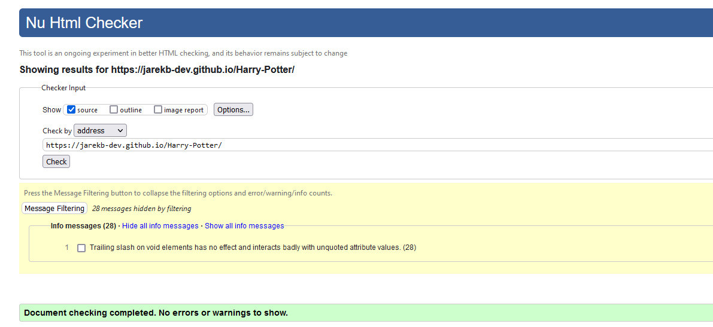

> Warnings regarding using a forward slash with a void (single tag) elements.

---

## CSS Validator

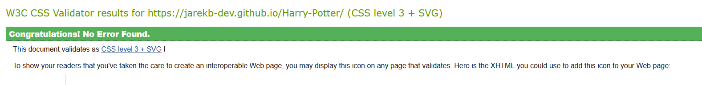

---

## JavaScript Beautify

- All content came out with no syntax errors.

---

## User Testing

4 Testers have been asked following questions:

1. _Do you understand the purpose of this website?_

2. _Can you turn on and off the sound in the game?_

3. _Can you fill up Players Name and progress further?_

4. _Do you understand Game rules?_

5. _Is the timer working correctly?_

6. _Are cards flipping correctly due to Player's actions?_

7. _Is game result shows correct message based on Player's actions?_

8. _Did you have any problems with responsiveness on mobile/laptop/desktop?_

9. _Did you experience any performance issues during gameplay?_

### **All above questions have been answered positively with no experienced issues. Testers understood rules of the game. Navigation was easy and predictable and game logic was working as per Player's actions. There were no issues in regards to responsiveness on different screen sizes.**

---

## Bugs

1. Sliding effect on main screen causing horizontal scrolling - **FIXED**

2. Name screen Modal displaying incorrectly on different devices than desktop - **FIXED**

3. Performance issues with fontawesome icons effecting lighthouse. - **FIXED**

4. Theme sound playing during the game, as should be playing only on Main Screen - **FIXED**

5. Timer positioning problems on smaller screen devices - **FIXED**

---

# $${\color{orange}Deployment}$$

## Site was deployed using GitHub pages following steps below:

1. Navigate to repository that can be found here : [Repository](https://github.com/JarekB-dev/Harry-Potter)

2. Click on `Settings` in the navigation menu of _Kitchen Makers_ repository.

3. Select `Pages` in the left side navigation bar.

4. From the `Source` drop-down menu, select the `Deploy from a branch`.

5. From `Branch` drop-down select `main` branch.

6. Next drop-down menu should be `/(root)`.

7. Select `Save`.

8. After couple of minutes link to live website was shown above `Source` section.

## For more information please follow this link: [GitHub Pages](https://docs.github.com/en/pages/getting-started-with-github-pages/creating-a-github-pages-site)

---

# $${\color{orange}Resources}$$

### Reset CSS

> Reset Css by Josh Comeau helped me to override browser default settings - (https://www.joshwcomeau.com/css/custom-css-reset/)

### Stack Overflow

> Used to overcome issues with JavaScript logic and sound toggle. - (https://stackoverflow.com/)

### Balsamiq

> Used to create Wireframes for this project. - (https://balsamiq.com/)

### Medium.com

> Helped me tremendously with logic to flip card game. - (https://medium.com/free-code-camp/vanilla-javascript-tutorial-build-a-memory-game-in-30-minutes-e542c4447eae)

### Qualitylogoproducts

> Color theme for the Game. - (https://www.qualitylogoproducts.com/blog/harry-potter-color-schemes/)

### iStock

> Background images - (https://www.istockphoto.com/)

### Inspire Uplift

> Card icons - (https://www.inspireuplift.com/)

---

# $${\color{orange}Credits}$$

- Main Screen background - [Pxfuel](https://www.pxfuel.com/en/desktop-wallpaper-zsjdl)

- Name Screen background - [iStock by BabySofja](https://www.istockphoto.com/vector/seamless-blue-brick-wall-background-texture-pattern-gm908352988-250237045?clarity=false)

- Game Area background - [iStock by Anzela Ksenofontova](https://www.istockphoto.com/vector/red-brick-wall-texture-with-spotlight-vintage-textured-background-in-cartoon-style-gm1461448229-495416939?clarity=false)

- Card Icons - [Inspire Uplift by JayFKelsey](https://www.inspireuplift.com/220-Harry-Potter-Cute-Bundle-Svg-Harry-Potter-Clipart/iu/490704)

- Harry Potter logo [Clipartmax](https://www.clipartmax.com/middle/m2H7G6H7Z5H7K9Z5_harry-potter-logo-png/)

- Hogwarts Houses logo [PngFind](https://www.pngfind.com/mpng/TRmiiRi_gryffindor-house-harry-potter-hogwarts-slytherin-crest-harry/)

- Theme sound [CJoint](https://www.cjoint.com/c/KCom1bNTX7X)

- Matching card sound [PixaBay](https://pixabay.com/sound-effects/short-success-sound-glockenspiel-treasure-video-game-6346/)

- Game explanation transformation sound - [PixaBay](https://pixabay.com/sound-effects/platesliding-65587/)

- Win game sound - [PixaBay](https://pixabay.com/sound-effects/tada-fanfare-a-6313/)

- Sound toggle images [Icons8](https://icons8.com/icon/set/volume-off/matisse)

## All images/sounds were used for educational purposes only.

---

# $${\color{orange}Acknowledgments}$$

## Derek McAuley

> My Mentor that provided me with helpful tips, feedback and support during this project.

## My friends for helping me with testing game features.
