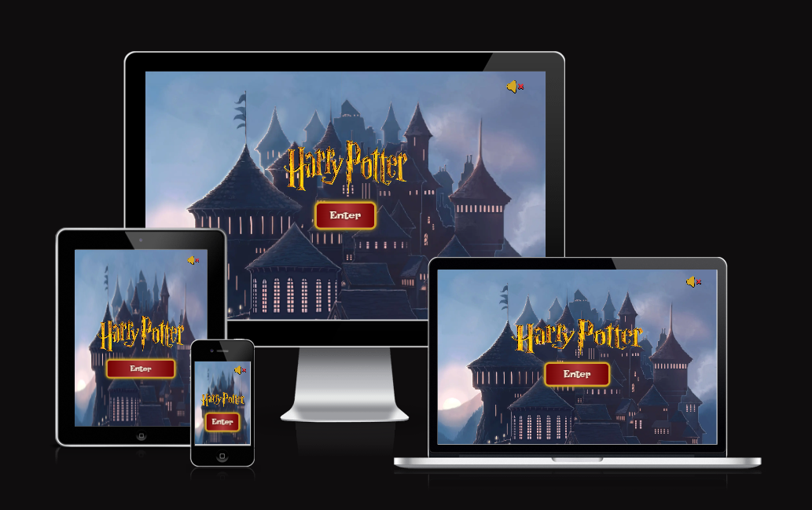

# $${\color{gold}Harry \space Potter \space Game}$$

## **This is second project for Code Institute - flip card game with Harry Potter theme.**

---

### _Game offers great challenge for all Harry Potter fans. Reveal cards with Harry Potter universe characters with time limit._

---

### [Live Site](https://jarekb-dev.github.io/Harry-Potter/)

---

### [Project Repository](https://github.com/JarekB-dev/Harry-Potter)

---

## Table of Contents

1. [UX](#ux)
2. [Features](#features)
3. [Features to implement](#implement)
4. [Technologies Used](#technologies)
5. [Testing](#testing)
6. [Deployment](#deployment)
7. [Resources](#resources)
8. [Credits](#credits)
9. [Acknowledgments](#acknowledgments)

---

# $${\color{orange}UX}$$

- User should be able to navigate in the game with no issues.
- User should see full game area with cards in the middle of the screen.
- User should be able to start the game with timer set to 60 seconds to finish the game.
- User should to flip cards to see their corresponding images.
- User should be able to see game result after fining all matching cards or when timer ends.
- User should be able to restart the game and reset the timer.
- User should be able to turn on and off the sounds in the game.

## Theme

My decision was that the most appropriate approach would be to use colors from Hogwarts House of Main protagonist - Gryffindor, therefore I have used below colors:

    - #740001 - Dark Red
    - #D3A625 - Gold
    - #EEBA30 - Yellow

I wanted to make sure that colors have proper contrast and are easily read by visual impaired users, but also to be similar to the one used in Harry Potter logo. Also, font have been chosen with same in mind to make sure that all information is clear and easy to read. Therefore, game contain below font:

    - Lakki Reddy

## Wireframes

### Main Screen - Desktop View

---

---

### Name Screen - Desktop View

---

### Game Explanation Screen - Desktop View

---

### Game Area - Desktop View

---

### Game result - Desktop View

---

### Main Screen - Mobile View

---

### Name Screen - Mobile View

---

### Game Explanation Screen - Mobile View

---

### Game Area - Mobile View

---

### Game Result - Mobile View

---

# $${\color{orange}Features}$$

**Main Screen**

- Center logo with button to progress into Game Area.
